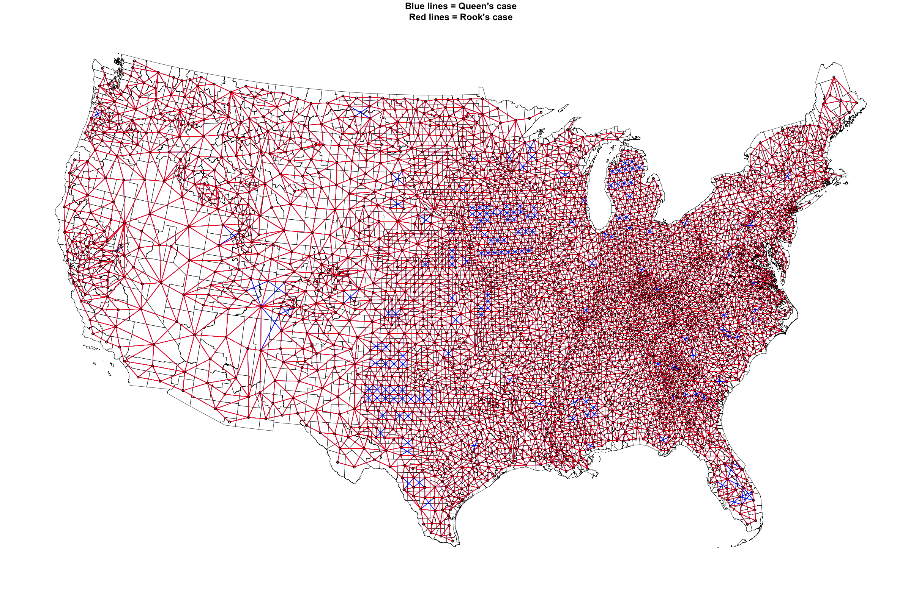

Welcome to my GitHub! Please check out my [personal website](https://idblr.rbind.io/) to learn more about me and my work.

I am a Postdoctoral [Cancer Prevention Fellow](https://cpfp.cancer.gov/) at the [National Cancer Institute](https://www.cancer.gov/) (NCI) working within the [Occupational and Enviornmental Epidemiology Branch](https://dceg.cancer.gov/about/organization/programs-ebp/oeeb) of the [Division of Cancer Epidemiology and Genetics](https://dceg.cancer.gov/).

My [research](https://www.ncbi.nlm.nih.gov/myncbi/ian.buller.1/bibliography/public/) focuses on the (geo)spatial and environmental epidemiology of cancer and infectious disease, including novel applications of spatial point pattern analyses (such as R packages: [envi](https://github.com/Waller-SUSAN/envi) and [gateR](https://github.com/Waller-SUSAN/gateR)). Here, you will also find public repositories that are companions for peer-reviewed manuscripts, including the effort to define the NCI-designated Cancer Center [catchment areas](https://github.com/idblr/NCI_Cancer_Center_Catchment_Areas).

|  |  
| ------------- | ------------- |
